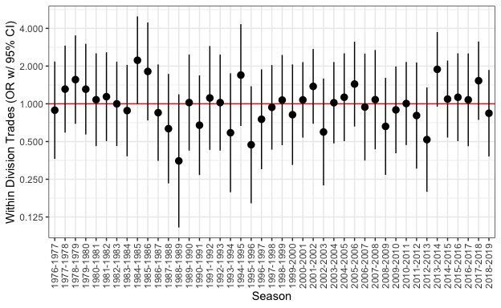
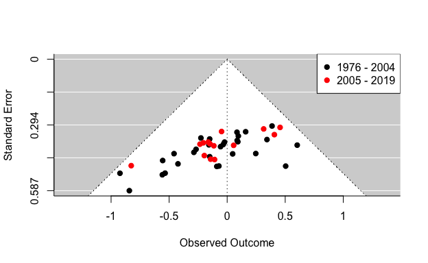

# Introduction

A common refrain among sports commentators is that professional sports teams avoid trading players with other teams from within their own division [@wong2017; @simmons]. Some conjectures on why this should be avoided include: not wanting to improve the competitiveness of a team's direct rivals [@ley2017], especially in leagues where games within the division are more common than other match-ups [@bates2015], or wanting to avoid fans being reminded of players they gave up [@fs2015], especially if they turn out to play better for their new teams [@ley2017]. Despite the frequency of this speculation, attempts to quantify the actual frequency of such a prohibition has been rare [for one limited exception, see @ahr2018].

Beyond the popular perception of the avoidance of intra-division trades, there is also ample scholarly literature that would lead us to the same expectation, particularly in professional sports [@Stewart1999]. These expectations have theoretical roots in literature on organizational competition broadly, and management strategy more specifically. 

A primary basis for such an expectation arises from organizations avoiding collaborating with their (perceived) competitors. For example, within a field where the actors are (or are perceived to be) competitors with one another, they may avoid cooperating with one another because it is perceived to be a competitive disadvantage [@Hoffmann2018], though that assumption has been questioned [@Bengtsson1999; @peng12]. Instead of cooperating directly with one's competitors, actors may therefore seek out means of collaboration with those outside the competitive field [@Soda_2017]. Or they may develop more narrow definitions of who their competitors are [@Barman_2002]. In combination, these could facilitate the avoidance of intra-division trades through prioritizing trades with teams who are not perceived as their direct competitors--i.e., from outside their own division.

Additionally, the avoidance of competitor collaborations could be facilitated by the availability or pursuit of alternative strategies for developing competitive advantages. In this particular case, such alternatives could focus on strategies to enhance player development (vs. player "acquisition" through trades). This could take the form of enhancing other means of recruitment such as stable pipelines for talent acquisition [@brymer14; @Elfenbein2014], wherein general managers could develop stable relationships with particular representatives to provide comparative advantages in access to players on the free agent market. By shifting the focus to alternative strategies of player acquisition and/or development in these ways, teams could further avoid necessitating collaboration (through trades) within their division. 

Organizations also carve out recruitment niches that avoid direct competition [@Soltis_2010; @Barman_2002]. For example, NBA teams have recently developed improved "apprentice" opportunities through the "Developmental League," while some teams have focused on foreign partnerships to open opportunities to gain contractual rights to players outside of the trade system [@Keiper_2020]. While we do not empirically test the development of these alternative mechanisms here, each should facilitate teams' ability to avoid engaging in cooperating with their direct competitors--i.e., by avoiding intra-division trades--directly paralleling the expectation from the popular perception as reported above. 

In sum, we therefore investigate how strongly division shapes trade partners among National Basketball Association (NBA) franchises. Drawing both on the popular refrain and supporting scholarly literature, this investigation begins with the expectation that teams may tend to avoid trading with other teams within their own division.


# Data

<div class="layout-chunk" data-layout="l-body">


</div>


To address this question, we draw on a database of all player transactions in the NBA from the beginning of the 1976 season---when the NBA merged with the ABA uniting major professional basketball in the US under one league---through the completion of the 2018-19 season [@richardson2020]. We compile this list of 1,977 trades into 43 annual trade networks, with the nodes representing teams, and each edge representing a unique trade between those teams. Each trade is assigned to the "trade season" which runs from the end of the previous season through the corresponding season's trade deadline.^[The opening of the trade season begins either (1) with the conclusion of the previous season's playoffs (early in the observed period), or on a specified date each summer (later in the observed window). Using these dates, there were no ambiguous trades that we were unable to attribute to a particular season.] The number of teams within each annual slice changes over time as the league gradually expanded from 22 to 30 teams.^[Unless otherwise specifically noted, all historical accounts in the text were pulled from Wikipedia and confirmed on nba.com.]. The number of trades observed within each slice varies from year to year (range 22-86 or 0.8-2.9 when stated as per-team averages; see Figure \@ref(fig:trades-per-year)), and teams exhibit differing rates of trading (see Figure \@ref(fig:trades-per-team)). 

<!--

-->

<div class="layout-chunk" data-layout="l-body">
<div class="figure">

<p class="caption">(\#fig:trades-per-year)**Number of Trades by Year.** (standardized to a per team rate)</p>
</div>

</div>


Figure \@ref(fig:trades-per-year) presents the trend of the average trades per season. Since, the number of teams varies across the window, we standardize these values to represent the number of trades *per team* in each season. This pattern shows a roughly U-shaped trend, with the highest rates of trades (nearing 2 per team) occurring early and late in the period and the lowest rates occurring in the early 1990s. Notably, this low-point came *after* the introduction of unrestricted free-agency (in 1988), which allowed players to sign with any team after their contract expires. As a corollary, Figure \@ref(fig:trades-per-team) presents the frequency distribution of trades per team across the full observed window. There are some teams (e.g., the Spurs) who consistently trade less frequently, and others who are much more trade active (e.g., the Mavericks).

<!--

-->

<div class="layout-chunk" data-layout="l-body">
<div class="figure">

<p class="caption">(\#fig:trades-per-team)**Average Trades by Team.** (standardized to a per season rate)</p>
</div>

</div>


To address our main research question, we needed to supplement these trade data by compiling a list of each team's division membership. From the 1976-77 season through 2003-04, there were four divisions (Atlantic, Central, Midwest, and Pacific). From the 2004-05 season onward, there were six divisions (Atlantic, Central, Southeast, Northwest, Pacific, and Southwest).^[The divisions are aggregated into conferences, with the Atlantic, Central, and Southeast being in the Eastern Conference, and the Midwest, Pacific, Northwest, and Southwest being in the Western Conference.] While those division/conference names otherwise remained stable, teams changed divisions at various times, whether for geographic reasons or as new expansion teams were added to the league. Accordingly, each team's division is assigned as current to a particular trade season (for example, the Buffalo Braves were in the Atlantic division in 1977-78, but became the San Diego Clippers and moved to the Pacific division for the 1978-79 season). Combined, these data allow us to investigate the tendency for teams to avoid trading with other teams in their own division. 


# Analysis and Findings

Analytically, we proceed in three steps, which allow us to address two simultaneous aims. Primarily, these steps allow us to build an appropriate test of our research question. Secondarily, these steps also allow us to illustrate the proper way to statistically condition a question such as this, and to explain the need for doing so. This combination further motivates our usage of a relatively recent development for statistically modeling weighted network data. 

<!-- Manually wrap in distill HTML tags to get a proper caption. -->
<div class="figure">
<div class="layout-chunk" data-layout="l-body">

```{=html}
<iframe src="NBA_Trades.html" width="80%" height="600px"></iframe>
```

</div>

<p class="caption">Video 1. **Dynamic Visualization of Annual Trade Networks** Note: Intra-division trades are highlighted in red. Node color and position indicates division. The upper-right menu allows the animation speed to be adjusted while visualizing the entire sequence, or the forward/back buttons at the bottom can be used to step-wise animate the visualization one annual slice (trade season) at a time.</p>
</div>

Our first step is to tabulate the number of trades observed both within and across divisions. This tabulation is presented in the form of a mixing matrix, which shows---at the level of divisions---how many trades occur between teams of the same division (diagonal) and between teams of differing divisions (off-diagonal). We present these mixing matrices in two aggregations. The first represents when there were four divisions, i.e., all years prior to division expansion, a period which spans from 1976-2004. The second window began in 2005 and runs through the end of our analytic period at the end of the 2018-19 season, during which the teams were separated into six divisions. To provide a visual representation of the changes in these division-specific trade patterns across the examined period, Video 1 presents a dynamic visualization of each year's trade network.^[The appendices also include full replication code for all analyzes conducted and the generation of this dynamic visualization.]


<div class="layout-chunk" data-layout="l-body">

Table: (\#tab:mm-1976-2004)**Mixing Matrix for the period 1976 - 2004**

|**1976 - 2004** | Atlantic| Central| Midwest| Pacific|
|:---------------|--------:|-------:|-------:|-------:|
|Atlantic        |       49|     135|     140|     124|
|Central         |         |      62|     156|     175|
|Midwest         |         |        |      69|     114|
|Pacific         |         |        |        |      53|

</div>


<div class="layout-chunk" data-layout="l-body">

Table: (\#tab:mm-2005-2019)**Mixing Matrix for the period 2005 - 2019**

|**2005 - 2019** | Atlantic| Central| Northwest| Pacific| Southeast| Southwest|
|:---------------|--------:|-------:|---------:|-------:|---------:|---------:|
|Atlantic        |       23|      51|        62|      56|        42|        71|
|Central         |         |      18|        52|      42|        45|        41|
|Northwest       |         |        |        33|      41|        45|        55|
|Pacific         |         |        |          |       9|        52|        54|
|Southeast       |         |        |          |        |        16|        61|
|Southwest       |         |        |          |        |          |        31|

</div>


As can be seen in Tables \@ref(tab:mm-1976-2004) and \@ref(tab:mm-2005-2019), these tabulations would appear to suggest that there is an avoidance of trading with members of one's own division. For example in the pre-expansion era (1976-2004) only 22% (233/1077) of trades were within division, a ratio of approximately 3.6 trades across divisions for every one trade within division. 

While these mixing matrices may appear to support the prohibition against teams trading within their division, there are two caveats for interpreting these patterns which we address in each of our subsequent analytic steps. First, in order to test for whether teams avoid trading within their division we must first account for each team's tendency to trade at all, before we can assess with whom they conduct those trades. For example, in the 1976-77 trade season, there were 35 trades, of which 7 were within division and 28 across divisions. If we account for how many trades each team made, yet assumed that they made those trades without respect to division of their trade partner, random expectation would be that on average 7.6 trades (sd 2.2) would be within division and 27.4 (sd 2.2) would be across divisions. That is, this observed mixing ratio of 4.0 trades across division for every one within is actually consistent with the random expectations, and thus does not conform to a within division avoidance pattern.

Our second analytic step therefore addresses these conditional distribution assumptions that are not apparent from the mixing matrices alone. To properly condition a test to account for baseline expectations, we use what is known as the $\alpha$-index for computing segregation in networks [@moody2001]. Essentially, what the $\alpha$-index does is allow the estimates of frequency of ties between teams from the same division to be estimated as an odds ratio, which is properly conditioned to account for the number of trade partners one would expect to be within and across division, given the observed base rates of trading by each team, *if* they chose with whom to trade without respect to division [@Bojanowski:2014aa]. Since this is a homophily statistic, testing for ties between teams within the *same* division, a significantly *negative* $\alpha$-index would be consistent with teams following the proposed prohibition. Figure \@ref(fig:alphas) presents this $\alpha$-index for each trade season individually. What can be seen here is that in *none* of the observed trade years does the $\alpha$-index differ significantly from random expectation (OR=1). In other words this improved conditional form of the test suggests that there is no observed prohibition against teams trading within division.

<!--

-->

<div class="layout-chunk" data-layout="l-body">
<div class="figure">

<p class="caption">(\#fig:alphas)**Divisional Homophily in NBA Trades by Season.** (as computed by Moody's $\alpha$-index).</p>
</div>

</div>


Our third analytic step addresses one additional caveat necessary for appropriate interpretation. The $\alpha$-index used above only allows for ties in the network to be dichotomous. That is, within each trade season the test only asks whether each pair of teams trades with one another or not. However in these data it is possible (and observed) that some pairs of teams trade with each other multiple times within the same trade season. So we further need a version of the test that allows for the weighting of the edges in the network, to properly allow for these multiple trades to be incorporated into the estimate. We rely on a recently developed advance in Exponential-family Random Graph Models [ERGM, @strauss-ikeda1990;@lusher-etal2013;@handcock2019], that allow for estimation with weighted networks [@krivit2012;@krivitsky2019]. ERGM is a statistical model for explaining the structure of a network by means of various local tendencies for ties to be present or absent quantified by model terms such as density, degree, homophily, transitivity and so on. The magnitude of effect corresponding with each term is measured by an associated coefficient. In the player trade networks we are interested in verifying whether there is a (negative) divisional homophily effect, i.e. analogously to the above presented $\alpha$. This would indicated if (multiple) trades are more or less likely in pairs of teams belonging to the same division compared to team pairs in different divisions. A positive value of the coefficient would suggest homophily, while negative values would indicate heterophily (the hypothesized avoidance of within-division trading).

Adequate modeling a weighted network via an ERGM also requires adapting model specification to the distribution of trade counts across dyads by choosing an appropriate reference measure [@krivit2012, sec. 5.2]. While the typical approach involves assuming that the counts are Poisson-distributed, in practice empirical data distributions often exhibit an over-abundance of 0s (zero-inflation) and/or  greater variation than the Poisson distribution assumes (overdispersion). Table \@ref(tab:dyadic-trade-counts) summarizes that trading is relatively rare in general and it happens even more rarely that a pair of teams trades more than once in the same season. Formal tests of this distribution do indicate overdispersion [@cameron1990regression;@rpkg-AER].

<div class="layout-chunk" data-layout="l-body">

Table: (\#tab:dyadic-trade-counts)**Distribution of dyadic trade counts**. Frequency of number of trades in a season in pairs of teams.

| Number of trades|     N|    %|
|----------------:|-----:|----:|
|                0| 13720| 88.3|
|                1|  1683| 10.8|
|                2|   118|  0.8|
|                3|    11|  0.1|
|                4|     1|  0.0|

</div>


At this point we could either choose a non-Poissonian reference measure or simplify data by dichotomizing the counts (any number of trades vs no trades at all) and proceeding with a binary ERGM. We ran both versions, reaching the same conclusion. The homophily coefficient in the **binary** ERGM fit to all seasonal trade networks simultaneously, including season- and division-specific effects, is equal to 0.012 (standard error of 0.065, z-statistic of 0.188) again showing no avoidance patterns. The complete model is presented in Table \@ref(tab:model-binary-table) in the Appendix.   

Applying the **valued** ERGM--to account for the caveats raised above, and with the Conway-Maxwell-Poisson reference measure, we again find that in *none* of the seasons do teams exhibit a tendency to avoid trading with other teams from within their division. This is summarized with the "funnel plot" presented in Figure \@ref(fig:seasonal-ergms), that shows each of homophily coefficients from season-specific weighted ERGMs fall within the white cone of statistical *in*significance.

<!--

-->

<div class="layout-chunk" data-layout="l-body">
<div class="figure">

<p class="caption">(\#fig:seasonal-ergms)**Homophily Coefficients and Standard Errors from Weighted Exponential Random Graph Models.** (including base-rate effects)</p>
</div>

</div>


To summarize the results from Figure \@ref(fig:seasonal-ergms) in a single model, we also fit a pooled ERGM across all seasons, including a base-rate effect for each year's trade volume, similarly to the binary ERGM mentioned above.[^modelSpecification] These results are presented in Table \@ref(tab:model1-table-short). In this final specification, we find an aggregate same-division homophily effect (coefficient 0.006, standard error of 0.059, z-statistic of 0.102), that again shows no avoidance pattern. Fitting similar models to the periods 1976-2004 and 2004-2019 separately leads to almost identical results.[^periodModels]


<div class="layout-chunk" data-layout="l-body">

Table: (\#tab:model1-table-short)**Valued ERGM fitted to pooled seasonal data**. The table excludes seasonal constants, complete table is presented in Table \@ref(tab:model1-table) the Appendix.

|Effect      |  Estimate|        SE|         95% CI| p-value|
|:-----------|---------:|---------:|--------------:|-------:|
|*Homophily* | 0.0099434| 0.0587577| (-0.11;  0.13)|   0.866|

</div>


[^periodModels]: Results can be obtained from the authors upon request.

[^modelSpecification]: Pooling was performed by merging all seasonal networks into a single block-diagonal adjacency matrix and fitting a single model with block-diagonal sample space contraints. Further model specification details are presented in the Appendix.


# Discussion

In short, the empirical patterns do not support the popular claim that NBA teams are likely to avoid trading with teams from within their own division. However, the lack of support for this prohibition is only observed once the strategy for testing the question first accounts for the differential rates at which teams trade and therefore have the opportunity to trade with teams from within/outside their division. The lingering weak associations are even further reduced once including the weighting that is possible from multiple trades between partners in a single season. We are reticent to suggest that these findings necessarily alter the theoretical claims within organizational literature that competitors may avoid cooperating with one another [@Hoffmann2018, @Stewart1999]; however they do suggest that future scholarship may want to examine potential variation between the contexts where such prohibitions exist compared to others like the NBA case, where they seem to be violated.

It is worth mentioning that the models we have estimated in the results for Figure \@ref(fig:seasonal-ergms) are actually no different from what would have been possible through a generalized linear model predicting the (weighted) number of ties observed between pairs of teams. However, the value of introducing the weighted ERGM approach with these data is that if subsequent researchers want to take the next step to provide an explanatory account that further examines which teams are likely to trade with which others, this modeling framework would allow for the simultaneous estimation of predictive factors that variously operate at the node level (e.g., is a team that finished lower in the previous year's standings more likely to trade), the dyad level (e.g., are teams with higher total salaries more likely to trade with other teams who have lower total salaries), or structural features above the dyad (e.g., the tendency to form trade-triples or larger configurations through multi-team deals). The GLM framework would not be able to estimate each of these types of features in such a model without violating model assumptions (e.g., some of these are explicitly modeling the *dependency* between multiple trades).^[Additionally, the MRQAP framework would allow us to test the primary form of our question as a properly conditioned test for a weighted outcome, and to allow extensions that include testing nodal and dyadic covariates as described above. However, if structural features such as multi-team configurations or deals are part of those predictions, MRQAP proves more difficult for including such "supra-dyadic" structural features.] As such, in addition to our primary empirical conclusions, we hope that the illustration if how the weighted ERGM could be beneficial serves as a useful introduction to this modeling framework, which could be extended by future researchers using the data we provide.


## Details of model specification {.appendix}

Basic notation:

- $N$ -- number of unique team-season pairs
- $i, j \in \{1, ..., N\}$ -- team playing in a season (a team-season pair)
- $\{s_1, ..., s_i, ..., s_N\}$ -- season of each team-season pair
- $s_i \in \{1, ..., s, ..., S\}$ -- seasons
- $\{d_1, ..., d_i, ..., d_N\}$ -- division of each team-season pair
- $d_i \in \{1, ..., d, ..., D\}$ -- divisions
- $[y_{ij}]_{N \times N}$ -- A block-diagonal adjacency matrix of trades between teams in  seasons. For simplicity, but abusing notation slightly, $y_{ij}$ is the number of trades in a season between teams $i$ and $j$ in case of valued ERGMs and, in the case of binary ERGM, trade count dichotomised to $\{0,1\}$ (no trade vs any number of trades).

In words, each node of the network corresponds to a team playing in the particular season. Nodes are grouped into seasonal blocks such that trades can happen only within seasons (ties within blocks) but cannot happen between seasons (no ties between blocks).

The models use the following sufficient statistics:

- *Season-specific propensity to trade* represented by the number of trade participations by teams in season $s$:

$$g_1(y, s) = \sum_{i,j:\; s_i=s \,\vee\, s_j=s} y_{ij}$$

- *Division-specific propensity to trade* represented by the number of trade participations by teams in division $d$:

$$g_1(y, d) = \sum_{i,j:\; d_i = d \,\vee\, d_j=d} y_{ij}$$


- *Propensity towards within-division trading* represented by the number of trades involving teams from the same division:

$$g_2(y) = \sum_{i,j:\; d_i = d_j} y_{ij}$$

- *Over-/under-dispersion* statistic which modifies the reference measure into a Conway-Maxwell-Poisson-reference ERGM [c.f. @krivit2012, sec. 5.2.3]:

$$g_3(y) = \sum_{i,j} \log(y_{ij}!)$$


Pooled binary ERGM is specified as:

$$P( Y = y ) = \frac{\exp \left(
\sum_{s=2}^S \theta_s g_1 (y, s) +
\sum_{d=1}^D \theta_d g_1 (y, d) +
\theta_2 g_2 (y) \right)}{\kappa}$$


Pooled valued ERGM  is specified as:

$$P( Y = y ) = \frac{\exp \left(
\theta_3 g_3 (y) + 
\sum_{s=1}^S \theta_s g_1 (y, s) +
\theta_2 g_2 (y) \right)}{\kappa}$$


## Binary ERGM model fit {.appendix}


<div class="layout-chunk" data-layout="l-body">

Table: (\#tab:model-binary-table)Full results for the binary ERG model fit to pooled data.

|Effect                |   Estimate|        SE|         95% CI| p-value|
|:---------------------|----------:|---------:|--------------:|-------:|
|*Seasonal base rates* |           |          |               |        |
|1977-1978             |  0.0644406| 0.1270305| (-0.18;  0.31)|   0.612|
|1978-1979             |  0.0019118| 0.1298141| (-0.25;  0.26)|   0.988|
|1979-1980             |  0.0019118| 0.1298141| (-0.25;  0.26)|   0.988|
|1980-1981             | -0.0510792| 0.1292914| (-0.30;  0.20)|   0.693|
|1981-1982             | -0.0030148| 0.1271550| (-0.25;  0.25)|   0.981|
|1982-1983             |  0.1115175| 0.1227569| (-0.13;  0.35)|   0.364|
|1983-1984             |  0.0273161| 0.1258983| (-0.22;  0.27)|   0.828|
|1984-1985             | -0.1208734| 0.1327298| (-0.38;  0.14)|   0.362|
|1985-1986             | -0.2417971| 0.1397247| (-0.52;  0.03)|   0.084|
|1986-1987             | -0.0346893| 0.1285424| (-0.29;  0.22)|   0.787|
|1987-1988             | -0.1027360| 0.1317965| (-0.36;  0.16)|   0.436|
|1988-1989             | -0.2176491| 0.1320108| (-0.48;  0.04)|   0.099|
|1989-1990             | -0.3041787| 0.1314209| (-0.56; -0.05)|   0.021|
|1990-1991             | -0.2215179| 0.1271370| (-0.47;  0.03)|   0.081|
|1991-1992             | -0.4236381| 0.1385688| (-0.70; -0.15)|   0.002|
|1992-1993             | -0.3067667| 0.1314542| (-0.56; -0.05)|   0.020|
|1993-1994             | -0.3820715| 0.1358873| (-0.65; -0.12)|   0.005|
|1994-1995             | -0.4921488| 0.1433802| (-0.77; -0.21)|   0.001|
|1995-1996             | -0.3684377| 0.1300296| (-0.62; -0.11)|   0.005|
|1996-1997             | -0.3517095| 0.1291228| (-0.60; -0.10)|   0.006|
|1997-1998             | -0.2188828| 0.1227432| (-0.46;  0.02)|   0.075|
|1998-1999             | -0.3354370| 0.1282640| (-0.59; -0.08)|   0.009|
|1999-2000             | -0.3856509| 0.1309883| (-0.64; -0.13)|   0.003|
|2000-2001             | -0.1092535| 0.1184604| (-0.34;  0.12)|   0.356|
|2001-2002             | -0.1557096| 0.1201757| (-0.39;  0.08)|   0.195|
|2002-2003             | -0.3517095| 0.1291230| (-0.60; -0.10)|   0.006|
|2003-2004             | -0.1928606| 0.1216516| (-0.43;  0.05)|   0.113|
|2004-2005             | -0.1872482| 0.1217808| (-0.43;  0.05)|   0.124|
|2005-2006             | -0.2203466| 0.1229214| (-0.46;  0.02)|   0.073|
|2006-2007             | -0.3731218| 0.1291269| (-0.63; -0.12)|   0.004|
|2007-2008             | -0.3312835| 0.1272634| (-0.58; -0.08)|   0.009|
|2008-2009             | -0.1158522| 0.1195396| (-0.35;  0.12)|   0.332|
|2009-2010             | -0.0873887| 0.1187245| (-0.32;  0.15)|   0.462|
|2010-2011             | -0.0690321| 0.1182212| (-0.30;  0.16)|   0.559|
|2011-2012             | -0.3048899| 0.1261539| (-0.55; -0.06)|   0.016|
|2012-2013             | -0.1062350| 0.1192594| (-0.34;  0.13)|   0.373|
|2013-2014             | -0.1062350| 0.1192594| (-0.34;  0.13)|   0.373|
|2014-2015             |  0.0163922| 0.1160962| (-0.21;  0.24)|   0.888|
|2015-2016             | -0.1872482| 0.1217808| (-0.43;  0.05)|   0.124|
|2016-2017             | -0.2433833| 0.1237556| (-0.49;  0.00)|   0.049|
|2017-2018             | -0.1256048| 0.1198289| (-0.36;  0.11)|   0.295|
|2018-2019             | -0.0600277| 0.1179806| (-0.29;  0.17)|   0.611|
|Atlantic division     | -0.8016042| 0.0989169| (-1.00; -0.61)|   0.000|
|Central division      | -0.8667805| 0.0981918| (-1.06; -0.67)|   0.000|
|Midwest division      | -0.8698020| 0.1009794| (-1.07; -0.67)|   0.000|
|Northwest division    | -0.7167602| 0.1194368| (-0.95; -0.48)|   0.000|
|Pacific division      | -0.9125378| 0.0992412| (-1.11; -0.72)|   0.000|
|Southeast division    | -0.8610716| 0.1210921| (-1.10; -0.62)|   0.000|
|Southwest division    | -0.6650775| 0.1189080| (-0.90; -0.43)|   0.000|
|*Homophily*           |  0.0122759| 0.0651683| (-0.12;  0.14)|   0.851|

</div>


## Weighted ERGM model fit {.appendix}


<div class="layout-chunk" data-layout="l-body">

Table: (\#tab:model1-table)Full results for the weighted ERG model (Conway-Maxwell-Poisson reference) fit to pooled data.

|Effect      |   Estimate|        SE|         95% CI| p-value|
|:-----------|----------:|---------:|--------------:|-------:|
|CMP         |  0.2315843| 0.1220351| (-0.01;  0.47)|   0.058|
|1976-1977   | -0.8907633| 0.0786659| (-1.04; -0.74)|   0.000|
|1977-1978   | -0.8353665| 0.0749602| (-0.98; -0.69)|   0.000|
|1978-1979   | -0.9163628| 0.0789622| (-1.07; -0.76)|   0.000|
|1979-1980   | -0.8718532| 0.0760023| (-1.02; -0.72)|   0.000|
|1980-1981   | -0.9878413| 0.0849915| (-1.15; -0.82)|   0.000|
|1981-1982   | -0.9009026| 0.0765184| (-1.05; -0.75)|   0.000|
|1982-1983   | -0.8000072| 0.0693241| (-0.94; -0.66)|   0.000|
|1983-1984   | -0.8995605| 0.0754444| (-1.05; -0.75)|   0.000|
|1984-1985   | -1.0483261| 0.0885418| (-1.22; -0.87)|   0.000|
|1985-1986   | -1.0775154| 0.0913748| (-1.26; -0.90)|   0.000|
|1986-1987   | -0.9136535| 0.0767336| (-1.06; -0.76)|   0.000|
|1987-1988   | -0.9374337| 0.0817052| (-1.10; -0.78)|   0.000|
|1988-1989   | -1.1151354| 0.0874540| (-1.29; -0.94)|   0.000|
|1989-1990   | -1.1628729| 0.0838135| (-1.33; -1.00)|   0.000|
|1990-1991   | -1.0983683| 0.0794202| (-1.25; -0.94)|   0.000|
|1991-1992   | -1.3211755| 0.1036898| (-1.52; -1.12)|   0.000|
|1992-1993   | -1.2070537| 0.0889138| (-1.38; -1.03)|   0.000|
|1993-1994   | -1.2877179| 0.0980046| (-1.48; -1.10)|   0.000|
|1994-1995   | -1.3925032| 0.1059200| (-1.60; -1.18)|   0.000|
|1995-1996   | -1.2225016| 0.0836029| (-1.39; -1.06)|   0.000|
|1996-1997   | -1.2200099| 0.0809371| (-1.38; -1.06)|   0.000|
|1997-1998   | -1.1115641| 0.0737605| (-1.26; -0.97)|   0.000|
|1998-1999   | -1.2500706| 0.0872142| (-1.42; -1.08)|   0.000|
|1999-2000   | -1.2751475| 0.0904112| (-1.45; -1.10)|   0.000|
|2000-2001   | -1.0384705| 0.0712261| (-1.18; -0.90)|   0.000|
|2001-2002   | -1.0588213| 0.0719334| (-1.20; -0.92)|   0.000|
|2002-2003   | -1.2626974| 0.0885910| (-1.44; -1.09)|   0.000|
|2003-2004   | -1.0883370| 0.0733621| (-1.23; -0.94)|   0.000|
|2004-2005   | -1.0469835| 0.0672062| (-1.18; -0.92)|   0.000|
|2005-2006   | -1.0728968| 0.0674913| (-1.21; -0.94)|   0.000|
|2006-2007   | -1.1929729| 0.0767037| (-1.34; -1.04)|   0.000|
|2007-2008   | -1.1562207| 0.0768719| (-1.31; -1.01)|   0.000|
|2008-2009   | -0.9610409| 0.0627955| (-1.08; -0.84)|   0.000|
|2009-2010   | -0.9560768| 0.0615669| (-1.08; -0.84)|   0.000|
|2010-2011   | -0.9258245| 0.0602325| (-1.04; -0.81)|   0.000|
|2011-2012   | -1.1419441| 0.0751035| (-1.29; -0.99)|   0.000|
|2012-2013   | -0.9717012| 0.0636100| (-1.10; -0.85)|   0.000|
|2013-2014   | -0.9714144| 0.0642021| (-1.10; -0.85)|   0.000|
|2014-2015   | -0.8298264| 0.0536774| (-0.94; -0.72)|   0.000|
|2015-2016   | -1.0182917| 0.0669348| (-1.15; -0.89)|   0.000|
|2016-2017   | -1.0777438| 0.0717646| (-1.22; -0.94)|   0.000|
|2017-2018   | -0.9999934| 0.0660829| (-1.13; -0.87)|   0.000|
|2018-2019   | -0.9120202| 0.0579577| (-1.03; -0.80)|   0.000|
|*Homophily* |  0.0060264| 0.0593487| (-0.11;  0.12)|   0.919|

</div>


## Acknowledgements {.appendix}

We appreciate feedback we received on this paper from Skye Bender-deMoll, Pavel Krivitsky and David Schaefer.
```{.r .distill-force-highlighting-css}
```
